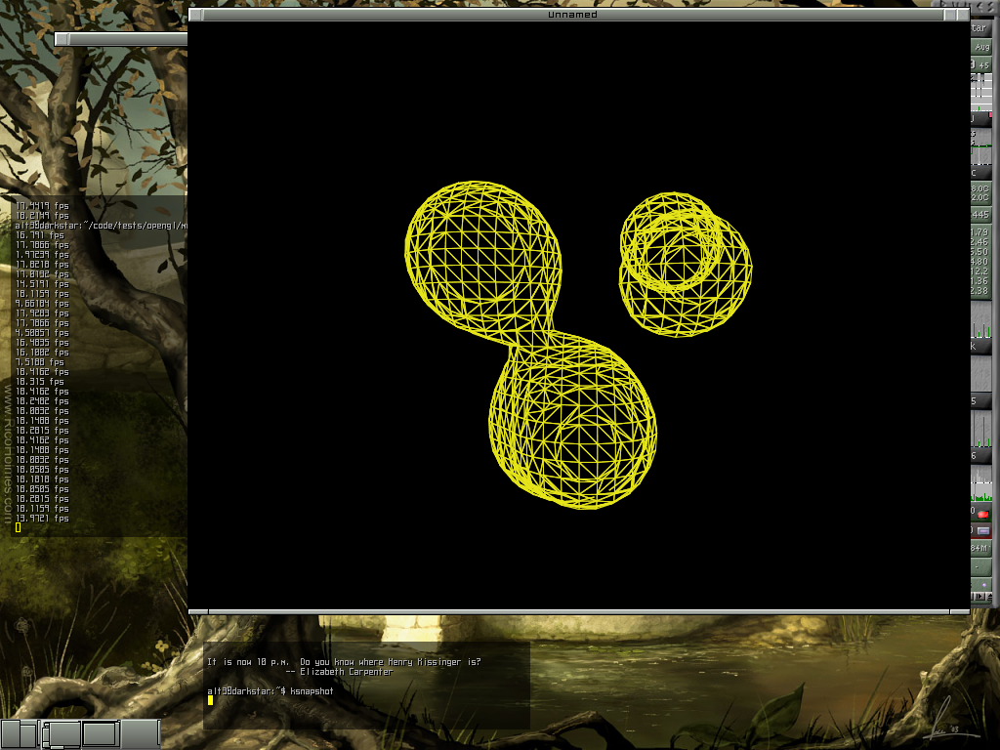

# metaballs
Some old source code to render metaballs (using OpenGL, SDL, also code is thus compilable and runnable under a GNU/linux or Windows target)

The source code is released as a tutorial and is of course highly questionable. Nevertheless, it is not meant to evolve.

To go further: http://en.wikipedia.org/wiki/Isosurface